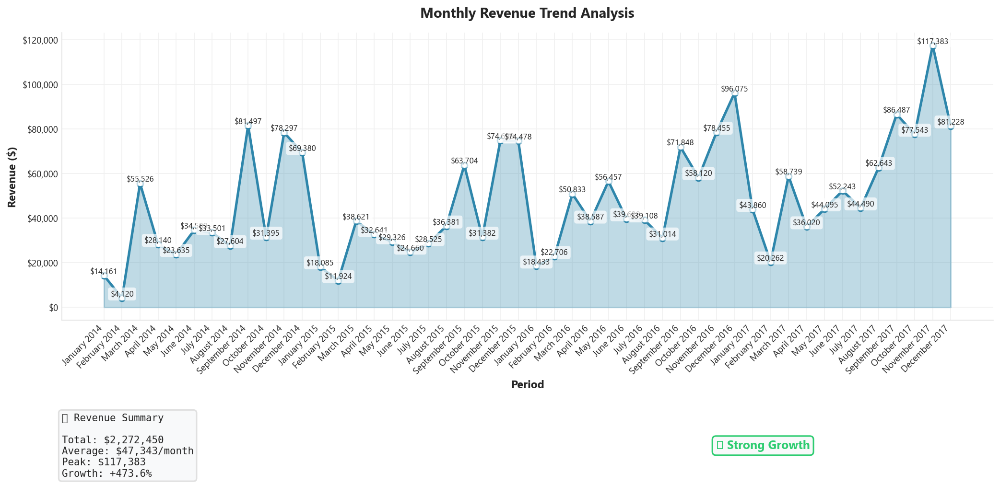
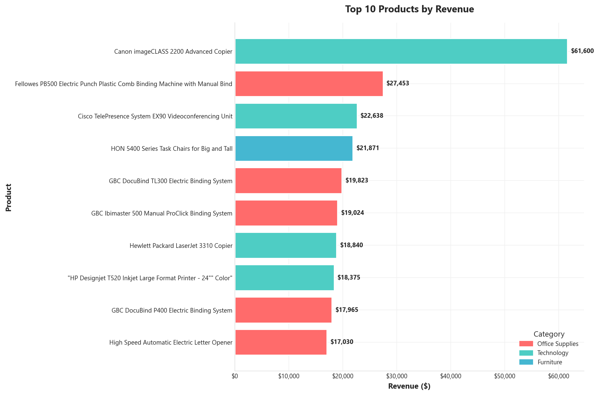
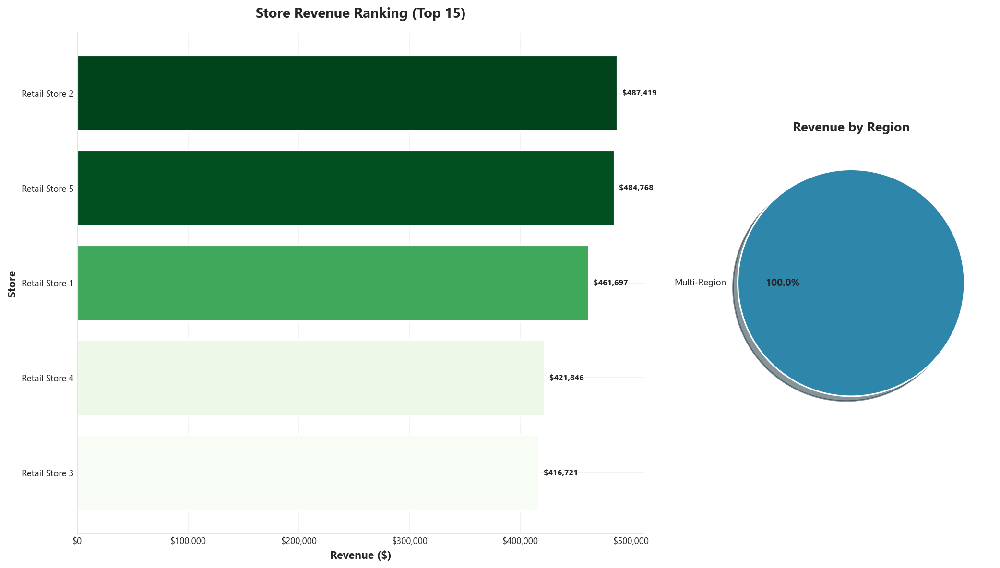
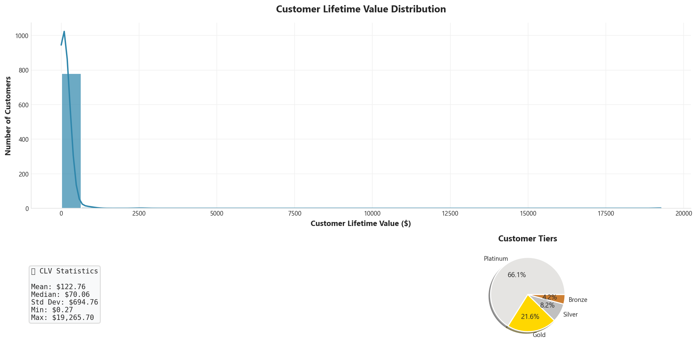
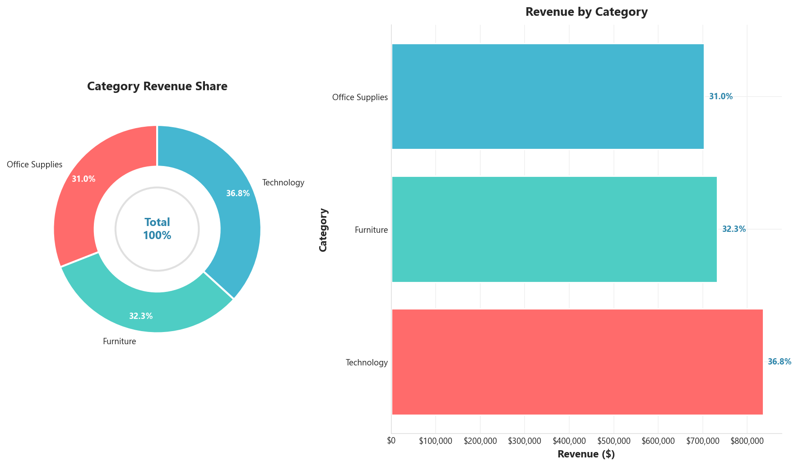
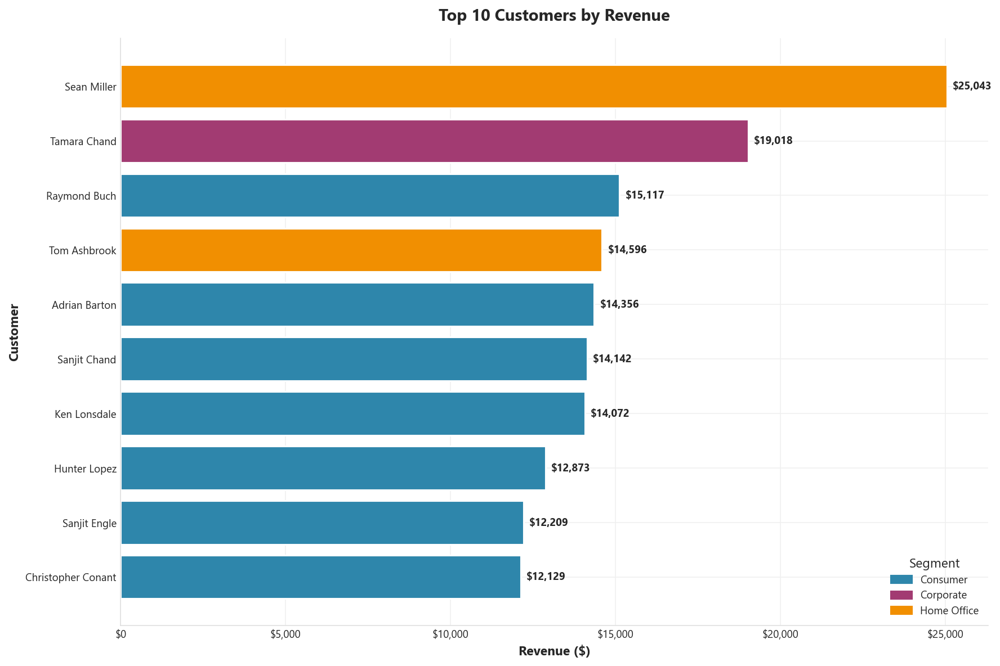
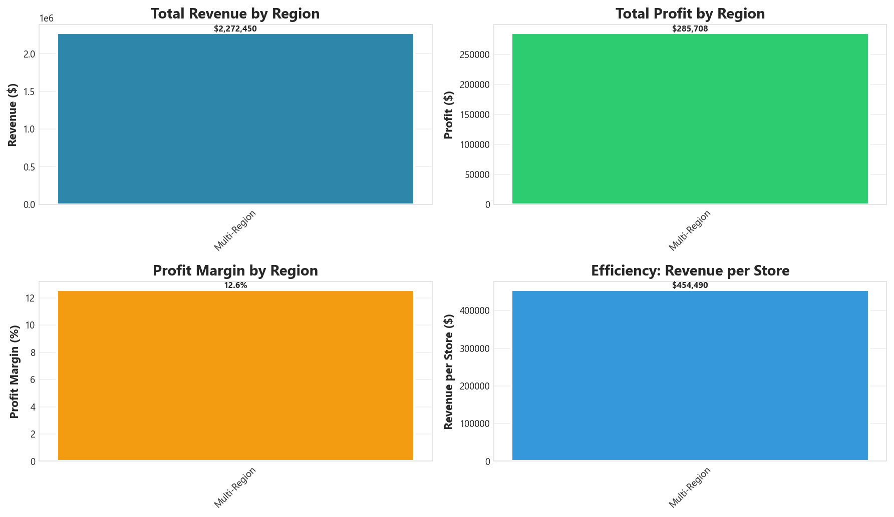

## 📊 Analytics Visualizations

The following visualizations are automatically generated from the retail data warehouse. Run `python main.py generate-static` to regenerate all images.

---

### 📈 Monthly Revenue Trend



*Revenue trajectory over time showing growth patterns, seasonal trends, and month-over-month changes. Includes summary statistics panel.*

---

### 🏆 Top 10 Products by Revenue



*Best-selling products ranked by total revenue with category color coding. Shows product performance and category distribution.*

---

### 🏬 Store Revenue Ranking



*Store performance comparison showing top 15 stores by revenue with gradient coloring. Includes regional revenue distribution pie chart.*

---

### 👥 Customer Lifetime Value Distribution



*Histogram with KDE overlay showing customer value distribution. Includes statistics panel and customer tier breakdown (Platinum, Gold, Silver, Bronze).*

---

### 📦 Category Revenue Contribution



*Combined donut chart and horizontal bar chart showing revenue share by product category with percentage breakdown.*

---

### 🌟 Top 10 Customers



*VIP customers ranked by total revenue contribution with segment color coding (Consumer, Corporate, Home Office).*

---

### 🗺️ Region Performance Dashboard



*Multi-panel grid showing regional performance across four metrics: total revenue, total profit, profit margin percentage, and revenue per store.*

---

## 🔄 Regenerating Visualizations

To regenerate all visualization images:

```bash
cd phases/phase-3-analytics
python main.py generate-static
```

To generate a complete PDF report:

```bash
python main.py generate-report
```

To generate both images and PDF:

```bash
python main.py generate-all
```

---

## 📄 Generated Assets

| Asset | Location | Command |
|-------|----------|---------|
| Monthly Revenue | `docs/images/monthly_revenue.png` | `generate-static` |
| Top Products | `docs/images/top_products.png` | `generate-static` |
| Store Ranking | `docs/images/store_ranking.png` | `generate-static` |
| CLV Distribution | `docs/images/clv_distribution.png` | `generate-static` |
| Category Contribution | `docs/images/category_contribution.png` | `generate-static` |
| Top Customers | `docs/images/top_customers.png` | `generate-static` |
| Region Performance | `docs/images/region_performance.png` | `generate-static` |
| Full Report | `reports/analytics_report.pdf` | `generate-report` |
